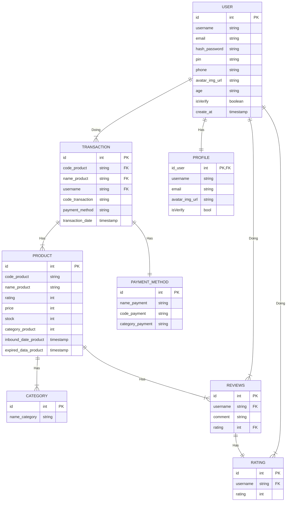
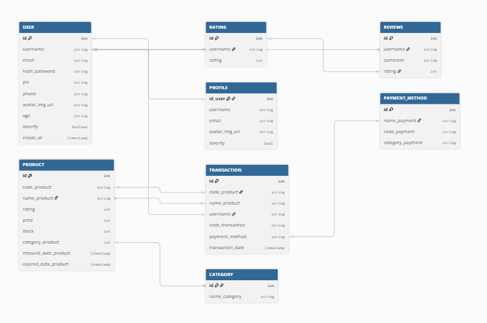

## FOOD E-COMMERCE ERD



```
// Use DBML to define your database structure
// Docs: https://dbml.dbdiagram.io/docs

TABLE USER{
    id int PK
    username string
    email string
    hash_password string
    pin string
    phone string
    avatar_img_url string
    age string
    isVerify boolean
    create_at timestamp
}

TABLE PROFILE{
    id_user int PK
    username string
    email string
    avatar_img_url string
    isVerify bool
}

TABLE PRODUCT{
    id int PK
    code_product string
    name_product string
    rating int
    price int
    stock int
    category_product int
    inbound_date_product timestamp
    expired_data_product timestamp
}

TABLE TRANSACTION{
    id int PK
    code_product string
    name_product string
    username string
    code_transaction string
    payment_method string
    transaction_date timestamp
}

TABLE CATEGORY {
    id int PK
    name_category string
}

TABLE PAYMENT_METHOD{
    id int PK
    name_payment string
    code_payment string
    category_payment string
}

TABLE REVIEWS {
    id int PK
    username string
    comment string
    rating int
}

TABLE RATING{
    id int PK
    username string
    rating int
}

Ref: "PRODUCT"."category_product" < "CATEGORY"."id"

Ref: "PRODUCT"."code_product" - "TRANSACTION"."code_product"

Ref: "PRODUCT"."name_product" > "TRANSACTION"."name_product"

Ref: "USER"."username" - "TRANSACTION"."username"

Ref: "TRANSACTION"."payment_method" - "PAYMENT_METHOD"."name_payment"

Ref: "USER"."id" - "PROFILE"."id_user"

Ref: "RATING"."id" - "REVIEWS"."rating"

Ref: "USER"."username" < "REVIEWS"."username"
Ref: "USER"."username" < "RATING"."username"
```


