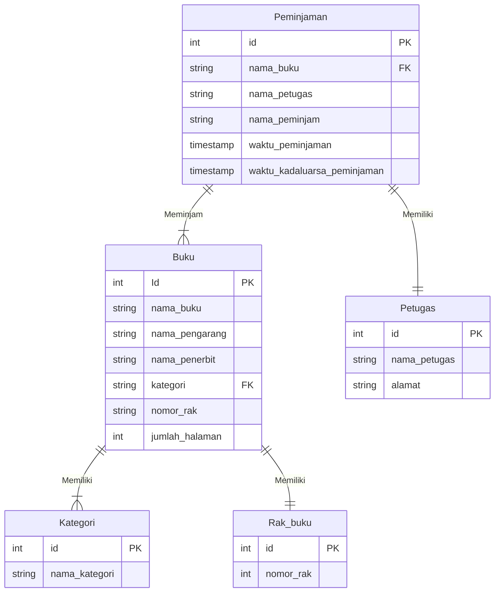
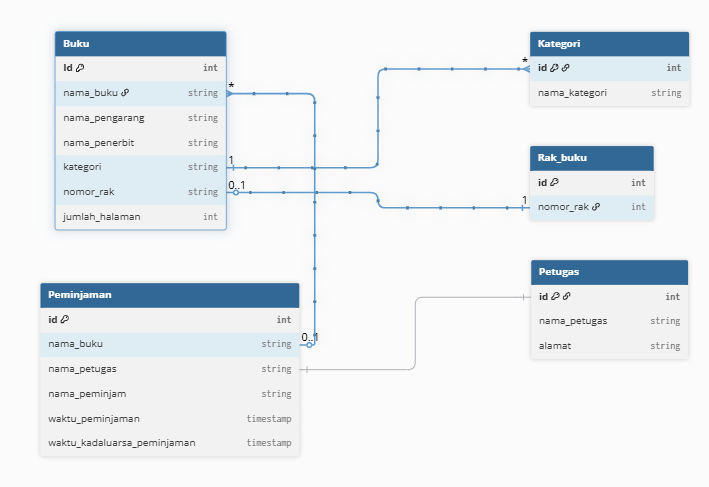

```mermaid
erDiagram
    Buku{
        int Id PK
        string nama_buku
        string nama_pengarang
        string nama_penerbit
        string kategori FK
        string nomor_rak
        int jumlah_halaman
    }

    Kategori{
        int id PK
        string nama_kategori
    }

    Rak_buku{
        int id PK
        int nomor_rak
    }

    Petugas{
        int id PK
        string nama_petugas
        string alamat
    }

    Peminjaman{
        int id PK
        string nama_buku FK
        string nama_petugas
        string nama_peminjam
        timestamp waktu_peminjaman
        timestamp waktu_kadaluarsa_peminjaman
    }

    Buku ||--|{ Kategori : Memiliki
    Buku ||--|| Rak_buku : Memiliki
    Peminjaman ||--|{ Buku : Meminjam
    Peminjaman ||--|| Petugas : Memiliki
```

